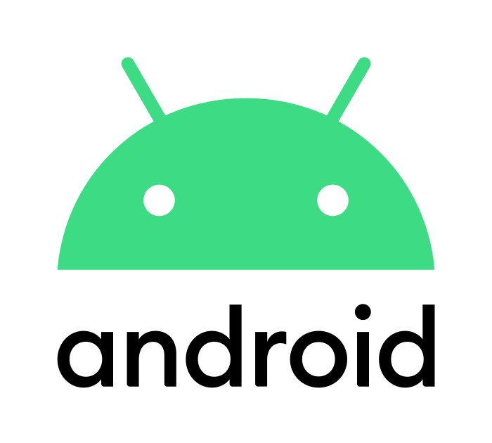
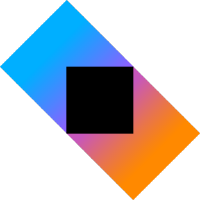
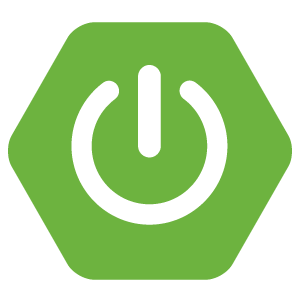
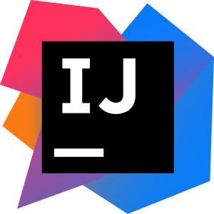
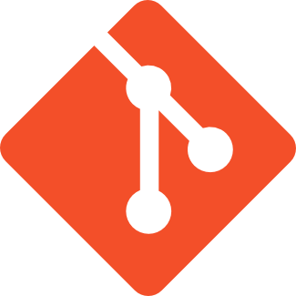

# Hi, I'm Julius Villagracia 👋🏽

👋 Hi, I'm an Android Developer with expertise in Kotlin and Java, focused on building scalable, high-performance mobile applications with clean, maintainable code. Experienced in applying MVVM design patterns and Clean Architecture principles to deliver robust and user-centric Android solutions.
  Proficient in Android UI development using XML, with additional experience building modern interfaces using Jetpack Compose through personal projects. Skilled in API integration and backend development using Kotlin, Spring Boot, and MongoDB, providing a comprehensive understanding of both mobile and server-side development.

📱 Mobile Expertise:

Android: Kotlin, Java, Jetpack Compose, MVVM
 Multiplatform: Kotlin Multiplatform
 Testing & QA: JUnit, UI Testing
 API Integration: RESTful APIs, third-party SDKs
 UI/UX Collaboration: Working closely with designers to deliver polished apps

💡 Passionate Learner:
Passionate about continuous learning and staying current with evolving technologies, currently exploring Kotlin Multiplatform (KMP) to extend cross-platform development capabilities while maintaining a strong foundation in native Android development.

Let’s collaborate and create world-class mobile experiences! 🚀

Let's connect and dive deep into all things tech! 💻💬

## :computer: Developer Skills

  
  
  
  
  
  

  
  
  
  
  
  
  

## 🧩 Featured Projects

